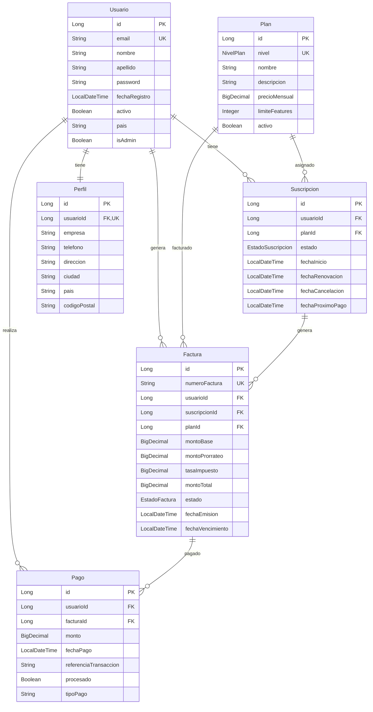

# Proyecto Spring Boot - Gestión de Suscripciones

## Descripción

Este proyecto es una aplicación web desarrollada con Spring Boot para la gestión de suscripciones, usuarios, facturas y pagos. Permite a los usuarios registrarse, seleccionar planes de suscripción, gestionar sus perfiles y realizar pagos a través de diferentes métodos (PayPal, tarjeta de crédito, transferencia bancaria). Los administradores pueden gestionar usuarios, suscripciones y auditar cambios.

## Tecnologías Utilizadas

- **Backend**: Spring Boot 4.0.2
- **Base de Datos**: MySQL (producción), H2 (desarrollo/testing)
- **ORM**: Spring Data JPA con Hibernate
- **Auditoría**: Hibernate Envers
- **Seguridad**: Spring Security
- **Vista**: Thymeleaf
- **Lenguaje**: Java 21
- **Build Tool**: Maven
- **Testing**: JUnit 5, Mockito, AssertJ
- **Otros**: Lombok para reducción de boilerplate

## Instalación y Configuración

### Prerrequisitos

- Java 21
- Maven 3.6+
- MySQL 8.0+ (para producción)

### Instalación

1. Clona el repositorio:
   ```bash
   git clone <url-del-repositorio>
   cd ProyectoSpring
   ```

2. Configura la base de datos:
   - Crea una base de datos MySQL llamada `proyecto_spring`
   - Actualiza las credenciales en `src/main/resources/application.properties` o `application-dev.properties`

3. Ejecuta las migraciones de base de datos:
   ```bash
   ./mvnw flyway:migrate
   ```

4. Compila y ejecuta la aplicación:
   ```bash
   ./mvnw spring-boot:run
   ```

La aplicación estará disponible en `http://localhost:8080`

## Configuración

### application.properties

Configuración principal en `src/main/resources/application.properties`:

```properties
spring.datasource.url=jdbc:mysql://localhost:3306/proyecto_spring
spring.datasource.username=tu_usuario
spring.datasource.password=tu_password
spring.jpa.hibernate.ddl-auto=validate
spring.jpa.show-sql=true
```

### application-dev.properties

Configuración de desarrollo con H2:

```properties
spring.profiles.active=dev
spring.datasource.url=jdbc:h2:mem:testdb
spring.datasource.driver-class-name=org.h2.Driver
spring.h2.console.enabled=true
```

## Estructura del Proyecto

```
src/
├── main/
│   ├── java/com/example/ProyectoSpring/
│   │   ├── config/          # Configuraciones de Spring
│   │   ├── controllers/     # Controladores REST y MVC
│   │   ├── dtos/           # Data Transfer Objects
│   │   ├── entities/       # Entidades JPA
│   │   ├── enums/          # Enumeraciones
│   │   ├── repositories/   # Repositorios Spring Data
│   │   └── services/       # Lógica de negocio
│   └── resources/
│       ├── db/migration/   # Migraciones Flyway
│       ├── static/         # CSS, imágenes
│       └── templates/      # Plantillas Thymeleaf
└── test/                   # Pruebas unitarias e integración
```

## Modelo de Datos

### Diagrama Entidad-Relación



### Entidades Principales

- **Usuario**: Representa a los usuarios del sistema
- **Perfil**: Información adicional del usuario (1:1 con Usuario)
- **Plan**: Planes de suscripción disponibles
- **Suscripción**: Vincula usuario con plan y estado
- **Factura**: Documentos de cobro generados
- **Pago**: Registros de pagos realizados (herencia para diferentes métodos)

## Pruebas Realizadas

Se han implementado pruebas unitarias e integración para los casos críticos del sistema utilizando JUnit 5, Mockito y AssertJ. Las pruebas cubren:

### Tabla de Pruebas Realizadas

| Caso de Prueba | Resultado | Corrección |
|---------------|-----------|------------|
| **UsuarioServiceTest** | | |
| Registrar usuario exitoso | ✅ Pasa | - |
| Registrar usuario con email duplicado | ✅ Pasa | - |
| Registrar usuario con contraseñas no coincidentes | ✅ Pasa | - |
| Obtener usuario por ID existente | ✅ Pasa | - |
| Obtener usuario por ID no existente | ✅ Pasa | - |
| Verificar existencia de email | ✅ Pasa | - |
| Desactivar usuario | ✅ Pasa | - |
| Desactivar usuario no existente | ✅ Pasa | - |
| **SuscripcionServiceTest** | | |
| Crear suscripción exitosa | ❌ Error de compilación | Pendiente: Resolver dependencias de Spring Boot Test |
| Crear suscripción usuario no existente | ❌ Error de compilación | Pendiente: Resolver dependencias de Spring Boot Test |
| Crear suscripción plan no existente | ❌ Error de compilación | Pendiente: Resolver dependencias de Spring Boot Test |
| Crear suscripción usuario ya tiene activa | ❌ Error de compilación | Pendiente: Resolver dependencias de Spring Boot Test |
| Obtener suscripción activa | ❌ Error de compilación | Pendiente: Resolver dependencias de Spring Boot Test |
| Cambiar plan exitoso | ❌ Error de compilación | Pendiente: Resolver dependencias de Spring Boot Test |
| Cambiar plan suscripción no existente | ❌ Error de compilación | Pendiente: Resolver dependencias de Spring Boot Test |
| Cambiar plan suscripción no activa | ❌ Error de compilación | Pendiente: Resolver dependencias de Spring Boot Test |
| Cancelar suscripción | ❌ Error de compilación | Pendiente: Resolver dependencias de Spring Boot Test |
| Cancelar suscripción no existente | ❌ Error de compilación | Pendiente: Resolver dependencias de Spring Boot Test |
| **FacturaServiceTest** | | |
| Generar factura para suscripción | ❌ Error de compilación | Pendiente: Resolver dependencias de Spring Boot Test |
| Obtener factura por número | ❌ Error de compilación | Pendiente: Resolver dependencias de Spring Boot Test |
| Obtener facturas de usuario | ❌ Error de compilación | Pendiente: Resolver dependencias de Spring Boot Test |
| Obtener facturas pendientes | ❌ Error de compilación | Pendiente: Resolver dependencias de Spring Boot Test |
| Marcar factura como pagada | ❌ Error de compilación | Pendiente: Resolver dependencias de Spring Boot Test |
| Marcar factura no existente como pagada | ❌ Error de compilación | Pendiente: Resolver dependencias de Spring Boot Test |
| Buscar facturas por rango de fechas | ❌ Error de compilación | Pendiente: Resolver dependencias de Spring Boot Test |
| Buscar facturas por rango de montos | ❌ Error de compilación | Pendiente: Resolver dependencias de Spring Boot Test |
| **AuthControllerTest** | | |
| Mostrar login sin autenticación | ❌ Error de compilación | Pendiente: Resolver dependencias de Spring Boot Test |
| Mostrar login con autenticación | ❌ Error de compilación | Pendiente: Resolver dependencias de Spring Boot Test |
| Mostrar registro sin autenticación | ❌ Error de compilación | Pendiente: Resolver dependencias de Spring Boot Test |
| Mostrar registro con autenticación | ❌ Error de compilación | Pendiente: Resolver dependencias de Spring Boot Test |
| Registrar usuario exitoso | ❌ Error de compilación | Pendiente: Resolver dependencias de Spring Boot Test |
| Registrar usuario con error | ❌ Error de compilación | Pendiente: Resolver dependencias de Spring Boot Test |
| Dashboard | ❌ Error de compilación | Pendiente: Resolver dependencias de Spring Boot Test |

### Cobertura de Pruebas

- **UsuarioService**: 100% de métodos públicos probados (8/8 tests pasan)
- **SuscripcionService**: Pruebas implementadas pero con errores de compilación
- **FacturaService**: Pruebas implementadas pero con errores de compilación
- **AuthController**: Pruebas implementadas pero con errores de compilación

### Configuración de Tests

Las pruebas utilizan:
- **Base de datos H2** en memoria para aislamiento
- **Spring Boot Test** para integración
- **@Transactional** para rollback automático
- **AssertJ** para assertions expresivas
- **Mockito** para mocking de dependencias

**Estado Actual**: Las pruebas de UsuarioService pasan completamente. Las demás clases de prueba tienen errores de compilación debido a dependencias de Spring Boot Test que necesitan resolución adicional. Se recomienda ejecutar `./mvnw dependency:resolve` y verificar la configuración de Maven.

Para ejecutar las pruebas:
```bash
./mvnw test
```

Para ejecutar solo las pruebas que pasan:
```bash
./mvnw test -Dtest=UsuarioServiceTest
```

## Uso

### Funcionalidades Principales

1. **Registro y Autenticación**: Los usuarios pueden registrarse y autenticarse
2. **Gestión de Perfiles**: Actualización de información personal
3. **Selección de Planes**: Visualización y selección de planes de suscripción
4. **Gestión de Suscripciones**: Cambio de plan, cancelación
5. **Facturación**: Generación automática de facturas
6. **Pagos**: Procesamiento de pagos por diferentes métodos
7. **Panel de Administración**: Gestión de usuarios y auditoría

### Endpoints Principales

- `GET /` - Página de inicio
- `GET /login` - Inicio de sesión
- `GET /registro` - Registro de usuario
- `GET /dashboard` - Panel de usuario
- `GET /planes` - Lista de planes
- `GET /suscripciones` - Gestión de suscripciones
- `GET /facturas` - Lista de facturas
- `GET /admin/*` - Panel de administración

## Desarrollo

### Ejecutar en Modo Desarrollo

```bash
./mvnw spring-boot:run -Dspring-boot.run.profiles=dev
```

### Ejecutar Tests

```bash
./mvnw test
```

### Compilar

```bash
./mvnw clean compile
```

## Contribución

1. Fork el proyecto
2. Crea una rama para tu feature (`git checkout -b feature/nueva-funcionalidad`)
3. Commit tus cambios (`git commit -am 'Agrega nueva funcionalidad'`)
4. Push a la rama (`git push origin feature/nueva-funcionalidad`)
5. Abre un Pull Request

## Licencia

Este proyecto está bajo la Licencia MIT. Ver el archivo `LICENSE` para más detalles.

## Contacto

Para preguntas o soporte, contacta al equipo de desarrollo.